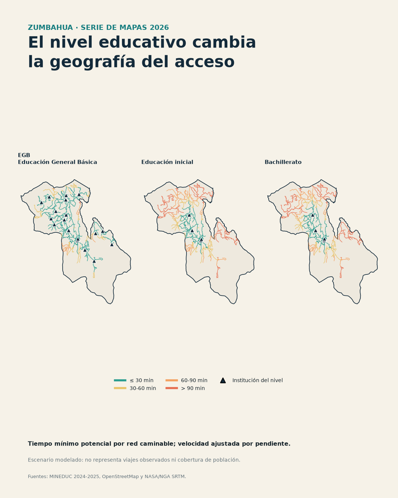

# Accesibilidad educativa en Zumbahua

Estudio reproducible, desarrollado desde gabinete, sobre la accesibilidad espacial a los equipamientos educativos de la parroquia Zumbahua, cantón Pujilí, provincia de Cotopaxi, Ecuador.

El proyecto actualiza y fortalece una tesis de 2019. Reconstruye los insumos geográficos con datos públicos y cambia el indicador principal: ya no se medirá solamente la proporción de red vial cubierta, sino la población estudiantil potencialmente atendida, el tiempo de viaje y la relación entre demanda y capacidad institucional.

## Pregunta de investigación

¿Cómo cambió entre 2017-2018 y 2024-2025 la oferta educativa de Zumbahua y qué desigualdades territoriales existen actualmente en el acceso potencial a educación inicial, EGB y bachillerato?

## Objetivos

1. Reconstruir un inventario verificable de instituciones educativas, matrícula, docentes y niveles ofertados.
2. Estimar tiempos de viaje a pie por la red de caminos y, de forma separada, escenarios motorizados hipotéticos.
3. Calcular cobertura ponderada por población escolar para umbrales de 15, 30, 45, 60 y 90 minutos.
4. Incorporar capacidad institucional mediante un indicador de área de captación flotante balanceada.
5. Identificar desiertos educativos, brechas territoriales y escenarios de mejora.
6. Publicar datos derivados, código, supuestos y controles de calidad reproducibles.

## Hallazgo preliminar

Una auditoría del registro administrativo oficial muestra:

| Periodo | Instituciones | Estudiantes | Docentes |
|---|---:|---:|---:|
| 2017-2018 Inicio | 20 | 4.717 | 226 |
| 2024-2025 Inicio | 19 | 2.302 | 206 |

La matrícula registrada disminuye 51,2 %, mientras el número de docentes baja 8,8 %. Este resultado todavía no se interpreta como pérdida real de acceso: primero se comprobarán cambios de cobertura, definiciones administrativas, migración, cierres, fusiones y traslados de matrícula.

## Serie de mapas

[Abrir la serie completa en PDF](serie-mapas/serie-mapas-zumbahua-2026.pdf)



La serie 2026 reúne cinco láminas: portada, territorio, oferta por nivel, cambio de matrícula y accesibilidad potencial comparada. También incluye cuatro tarjetas verticales listas para redes sociales en [`serie-mapas/social/`](serie-mapas/social/). Los tiempos representan un escenario sobre la red caminable de OpenStreetMap; no son viajes observados ni cobertura de población censal.

## Diseño analítico

```text
fuentes oficiales + OSM + elevación
                 │
                 ▼
       inventario y control de calidad
                 │
                 ▼
   red peatonal ─ tiempos ─ escuelas por nivel
                 │
                 ▼
 población escolar ponderada + capacidad escolar
                 │
                 ▼
 accesibilidad │ desigualdad │ escenarios de mejora
```

El estudio distingue entre:

- **Accesibilidad potencial:** oportunidades alcanzables bajo supuestos explícitos.
- **Accesibilidad observada:** viajes reales; no se afirmará sin datos de campo o movilidad.
- **Acceso educativo integral:** incluye calidad, costo, seguridad y pertinencia cultural; el análisis espacial solo representa una parte.

## Reproducibilidad

Requiere Python 3.11 o 3.12. Se recomienda usar [uv](https://docs.astral.sh/uv/).

```bash
uv sync --extra dev
uv run zumbahua-access download education
uv run zumbahua-access summary
uv run pytest
```

Los datos originales pesados no se versionan. El comando `download` guarda las fuentes en `data/raw/`; las tablas pequeñas derivadas y sus metadatos sí pueden publicarse.

## Estructura

```text
config/              parámetros y catálogo de fuentes
data/                datos manuales, crudos, intermedios y procesados
docs/                protocolo, fuentes, limitaciones y plan de publicación
notebooks/           exploración y comunicación visual
reports/             tablas, figuras y resultados redactados
src/zumbahua_access/ código reproducible
tests/               pruebas unitarias
```

## Fuentes principales

- Ministerio de Educación, registros históricos 2009-2024: https://www.datosabiertos.gob.ec/dataset/registro-de-matricula-mineduc
- Ministerio de Educación, base de datos 2024-2025: https://educacion.gob.ec/base-de-datos/
- Censo Ecuador 2022: https://www.censoecuador.gob.ec/resultados-censo/
- Geoportal IGM: https://www.geoportaligm.gob.ec/geoportal-igm/
- OpenStreetMap Ecuador: https://download.geofabrik.de/south-america/ecuador.html
- Tesis original: https://repositorio.puce.edu.ec/items/32dadfc4-1da5-42e0-ba9d-5a69bc09203a

El detalle de licencias, fechas y limitaciones está en [docs/fuentes_datos.md](docs/fuentes_datos.md).

## Estado

La versión `0.2.1` incorpora una serie cartográfica compacta, coordenadas educativas reconstruidas, relieve SRTM y tiempos potenciales por red. La cobertura poblacional final se publicará cuando se integren sectores censales y concluya la validación de coordenadas y caminos.

## Licencia y cita

El código se publica bajo licencia MIT. Los textos originales del proyecto pueden reutilizarse con atribución; cada fuente de terceros conserva su propia licencia. Consulte `CITATION.cff` para citar el repositorio.
